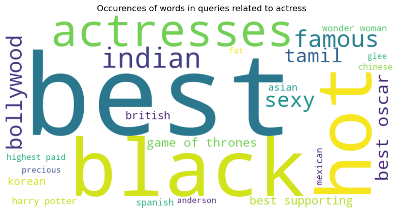
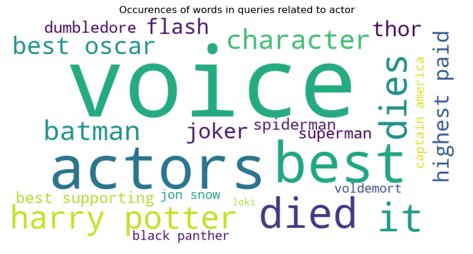

# Hollywood: a reflection of a patriarchal society ?

 ___Study of the evolution of the representation of women in the american cinema industry from 1888 to 2012___

# Abstract

In 1975, the filmmaker Laura Muley highlighted the underrepresentation of women in film industry and more broadly in visual culture. She introduced the term "male gaze" and allow people to question the place of women in the cinema industry. The American cinema industry played a strong role on the western society and appears as a good area of study to examine how women's representation has changed over the period of nearly a century. It would be interesting to first examine the underlying distinctions between men and women's presence in a movie. Specifically, to investigate the ages of the actors and actresses as well as the roles' percentage of occupations. Then, we will explore the representation of women in front of the camera. In fact, by examining the roles they play, one might gain an understanding of how the director stages them. 

# Research questions

* How has the women places evolves in the US cinema industry ? Does the cinema represent more men than women and has there been a change over the years ? Has the role played by woman and the attributes of their characters evolves through the year ? And finally how the place of actresses evolve for the public ?

# Proposed additional datasets
## Wikidata

* **Freebase_ID <=> Q-wikidata ID**: USmovies and movies with a freebase_ID were extracted with a SPARQL query. This allows us to obtain a table with a row containing the freebase_ID and the other row with the corresponding Q-ID.

* **Review score**: Review score of a film may been an interesting indicator for data analysis. For this, we search for the US movies that has a freebase_ID and a review score. Then, we also query the website from which the score was coming and the type of review. We chose to keep two differents review score both from [Rotten Tomatoes](https://www.rottentomatoes.com): the tomatometer score and the average review score. The first one is based on press reviews whereas the second is based on the website users.

## Google trends

* **Interest by region**: The relative number of request for the name of the main actors dataset were extracted from Google Trends using the PYTRENDS API. In order to compare all the actors on the same basis and because of the limitations from Google Trens, an iterative process was applied in order to normalize each subset of 5 actors.

* **Most common queries**: As we believe that the queries related to the actors might be interesting to assess how people percieve them, a first reaserch allowed us to gather queries related to "actor" and "actress". This could be used to extend the initial dataframe with the queries related to each movies' main actors.

  

# Methods

### Libraries
* empath
* country_converter
* wikidata2df
* plotly
* lxml
* pytrends
* wordcloud

## Dataset
### *-Movie metadata dataset*
To analyze only the US cinema industry, the first step was to exclude all the non-US movies. Then, we decided to import the available review_score from wikidata. To do so, we create a mapping dataset where each row contains the freebase_ID, the wikidata_ID, the review score and the origin of the review score.\
After opening the dataset, data exploration has been performed. USA is, by far, the country that produces the highest amount of movies.

### *-Character metadata dataset*
After exploring the dataset, we noticed that some informations were missing or wrong. Some Actor_gender were wrong and the ethnicity columns had just a freebase_Id but not any label. Missing values have been collected from wikidata and implemented in the dataset. The actor age at release has also been corrected, in some cases it was negative. This outlier values have been replaced by the opposite for the negative ones and by NaN for the big ones. Finally the dataset is filtered with only US movies.

### *-Movie summary dataset*
Movie summary dataset represents a great source of data for analyzing the representation of woman in the cinema industry. It has been decided to perform a pronoun analysis on each summary. The pronoun are separated in two categories: male and female. The occurence of each pronoun is counted and added into a dataframe. The principal and secondary characters are also extracted from the summaries. The occurence of the character's name are counted and the most frequent one is considered to be the principal character. The next step is to identify if the actor behind the character is a male or a female and to extract his name.

## Initial analyses

### *-Difference between men and women's place*
 **Step 1**: Investigate the part of women in movies across decades: 
* Evaluation of the mean and standard deviation of percentage of women in each decade
* Linear regression to see the parameters to see the parameters influencing the women part\

**Step 2**: Explore the difference in age between actor and actress:
* Evolution of the mean age across the decades

### *-Representation of women in movies : summary processing*
**Step 1**: Identify the main character and its gender \
**Step 2**: Examine the repartition between male and female principal character and its evolution across the decades \
**Step 3**: Examine how women's roles are qualified in the summaries. Conduct a lexical analysis to see the evolution of the way lexical fields associated with male gaze are used.

# Proposed timeline

* **02.12.22: Homework 2 deadline**
* 05.12.22 : data analysis, extract important features
* 10.12.22 : critic and select reliable results
* 16.12.22 : complete code, appropriate data visualization
* 20.12.22 : complete datastory
* **23.12.22 : Milestone 3 deadline**

# Organization within the team

For milestone 2:
* Antoine : Querying data from Wikidata
* Benoit : Queryring data from Google Trends
* Nathan : Dataset exploration, analyzing movie summaries
* Romain : Dataset exploration, focus on the USA

For milestone 3:
* Antoine : correlation research, complete final data visualisation
* Benoit : Statistical analysis, complete trends and website
* Nathan : Push on lexical analysis combine with trends
* Romain : Datastory, interactive data visualization and website
