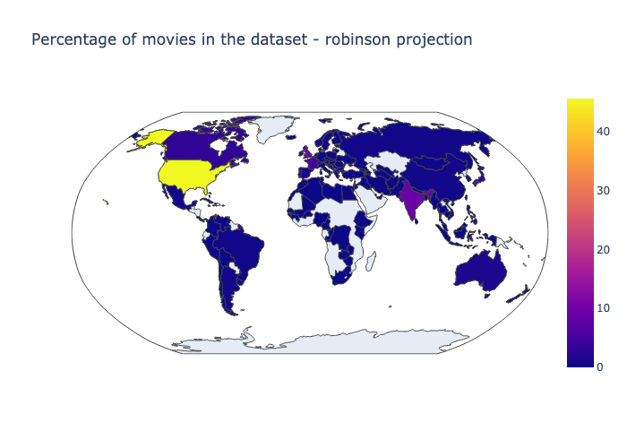

# Hollywood: a reflection of a patriarchal society ?

___Examining the role of Women in Hollywood and how it reflects our society ?___

## Abstract
The term “male gaze,” introduced by filmmaker Laura Mulvey in 1975, refers to the way in which the visual arts, particularly film, depict the world and women from a masculine point of view. This perspective is often characterized by an objectifying and sexualizing portrayal of women, which reinforces traditional gender roles and reinforces the dominant power dynamics between men and women. Mulvey’s concept of the male gaze has been influential in feminist film theory and has sparked important discussions about the representation of women in the film industry and broader visual culture.

The study of the representation of women in film is an important area of inquiry because of the significant role that the film industry plays in shaping cultural norms and values. By examining how women have been portrayed in film over the past century, we can better understand the changing attitudes towards gender and representation in society. This can be done by looking at both the perspective of the director, who plays a key role in shaping the representation of women on screen, as well as the perspective of the audience, who consume and are influenced by these representations. Through this analysis, it is possible to better understand the ways in which the film industry has influenced and been influenced by societal attitudes towards women, and to consider the potential for positive change in the representation of women in film and visual culture.

## Research questions
* <i><strong>How has the consideration of both directors' and audiences' perspectives impacted the evolution of gender bias in the portrayal characters in film? </strong></i>

## Website
To access our insane website please clic [here](https://badasteam.github.io/US_Cinema/Datastory)!

## Proposed additional datasets
### Wikidata

* **Freebase_ID <=> Q-wikidata ID**: USmovies and movies with a freebase_ID were extracted with a SPARQL query. This allows us to obtain a table with a row containing the freebase_ID and the other row with the corresponding Q-ID.

* **Review score**: Review score of a film may been an interesting indicator for data analysis. For this, we search for the US movies that has a freebase_ID and a review score. Then, we also query the website from which the score was coming and the type of review. We chose to keep two differents review score both from [Rotten Tomatoes](https://www.rottentomatoes.com): the tomatometer score and the average review score. The first one is based on press reviews whereas the second is based on the website users.

## Methods

### Pincipals Externals libraries
* empath
* country_converter
* wikidata2df
* plotly
* lxml
* wordcloud
* statsmodel
* sklearn
* tqdm

### Step 1: Data collection

* Movie metadata dataset: the movie metadata dataset has been augmented with wikidata information such has the review score and the main genre. The dataset contains 45 000 movies from 1888 to 2012. The dataset has been filtered to keep only the US movies.
* Character metadata dataset: the character metadata dataset contains 450 669 characters from 1888 to 2012. It has been augmented/corrected with data from wikidata such as the ethnicity and the gender of the actor which plays the character. The dataset has been filtered to keep only characters from US movies.

### Step 2: Data exploration

* Movie metadata dataset: the movie metadata dataset has been explored to see the evolution of the number of movies produced in the US cinema industry with their respective genre.
* Character metadata dataset: the character metadata dataset has been explored to see the evolution of the number of characters and their in the US cinema industry.

### Step 3: Data Analysis

* Movie summary dataset: the movie summaries has been analyzed with spacy. It allows to establish the list of character and determine th eimportance of their role in a particular movie. Their gender andthe verbs and adjectives used to describe them are also extracted.

### Step 4: Investigation of the results

* The results from the analysis are post-processed and filter to extract the most relevant information such as the lexical field associated with male and female through the years.

### Step 5: Data visualization

* Once meaningful results have been extracted, they are visualized with plotly to allow the reader to interact with the data.

### Step 6: Correlation analysis between the review score of the public and the gender of the main character

* The last study conducted consists of determined if there is a correlatio between the appreciation of a movie from the public and the gender of the main actor. To do so, data that were previously extracted is used. The correlation is computed upon different time periods and movie genres.

### Step 7: Creation of the data story and build of the website

## bADAssteam members contribution
* Antoine : Correlation research, complete final data visualisation
* Benoit : Summaries exploration: ML algorithm and NLP
* Nathan : Summaries analysis: Random forest and PCA
* Romain : Datastory, interactive data visualization and website

<!---
-------------------------------------------------------------------------------------------------------------------------------------------------------------------------------------------------------------------------------------------------------------------------------------------------------------------------------------------------------------------------------------------------------------------------------------------------------------------------------------------------------------------------------------------------------------------------------------------------------------------------------------------------------------------------

ANCIEN README

___Study of the evolution of the representation of women in the american cinema industry from 1888 to 2012___

## Abstract

In 1975, the filmmaker Laura Muley highlighted the underrepresentation of women in film industry and more broadly in visual culture. She introduced the term "male gaze" and allow people to question the place of women in the cinema industry. The American cinema industry played a strong role on the western society and appears as a good area of study to examine how women's representation has changed over the period of nearly a century. It would be interesting to first examine the underlying distinctions between men and women's presence in a movie. Specifically, to investigate the ages of the actors and actresses as well as the roles' percentage of occupations. Then, we will explore the representation of women in front of the camera. In fact, by examining the roles they play, one might gain an understanding of how the director stages them. 

## Research questions

* <i><strong>How has the consideration of both directors' and audiences' perspectives impacted the evolution of gender bias in the portrayal characters in film? </strong></i>

## Proposed additional datasets
## Wikidata

* **Freebase_ID <=> Q-wikidata ID**: USmovies and movies with a freebase_ID were extracted with a SPARQL query. This allows us to obtain a table with a row containing the freebase_ID and the other row with the corresponding Q-ID.

* **Review score**: Review score of a film may been an interesting indicator for data analysis. For this, we search for the US movies that has a freebase_ID and a review score. Then, we also query the website from which the score was coming and the type of review. We chose to keep two differents review score both from [Rotten Tomatoes](https://www.rottentomatoes.com): the tomatometer score and the average review score. The first one is based on press reviews whereas the second is based on the website users.

## Google trends

* **Interest by region**: The relative number of request for the name of the main actors dataset were extracted from Google Trends using the PYTRENDS API. In order to compare all the actors on the same basis and because of the limitations from Google Trens, an iterative process was applied in order to normalize each subset of 5 actors.

* **Most common queries**: As we believe that the queries related to the actors might be interesting to assess how people percieve them, a first reaserch allowed us to gather queries related to "actor" and "actress". This could be used to extend the initial dataframe with the queries related to each movies' main actors.

  

  

# Methods

### Libraries
* empath
* country_converter
* wikidata2df
* plotly
* lxml
* pytrends
* wordcloud

## Dataset
### *-Movie metadata dataset*
To analyze only the US cinema industry, the first step was to exclude all the non-US movies. Then, we decided to import the available review_score from wikidata. To do so, we create a mapping dataset where each row contains the freebase_ID, the wikidata_ID, the review score and the origin of the review score.\
After opening the dataset, data exploration has been performed. USA is, by far, the country that produces the highest amount of movies.

  

### *-Character metadata dataset*
After exploring the dataset, we noticed that some informations were missing or wrong. Some Actor_gender were wrong and the ethnicity columns had just a freebase_Id but not any label. Missing values have been collected from wikidata and implemented in the dataset. The actor age at release has also been corrected, in some cases it was negative. This outlier values have been replaced by the opposite for the negative ones and by NaN for the big ones. Finally the dataset is filtered with only US movies.

### *-Movie summary dataset*
Movie summary dataset represents a great source of data for analyzing the representation of woman in the cinema industry. It has been decided to perform a pronoun analysis on each summary. The pronoun are separated in two categories: male and female. The occurence of each pronoun is counted and added into a dataframe. The principal and secondary characters are also extracted from the summaries. The occurence of the character's name are counted and the most frequent one is considered to be the principal character. The next step is to identify if the actor behind the character is a male or a female and to extract his name.

## Initial analyses

### *-Difference between men and women's place*
 **Step 1**: Investigate the part of women in movies across decades: 
* Evaluation of the mean and standard deviation of percentage of women in each decade
* Linear regression to see the parameters to see the parameters influencing the women part\

**Step 2**: Explore the difference in age between actor and actress:
* Evolution of the mean age across the decades

### *-Representation of women in movies : summary processing*
**Step 1**: Identify the main character and its gender \
**Step 2**: Examine the repartition between male and female principal character and its evolution across the decades \
**Step 3**: Examine how women's roles are qualified in the summaries. Conduct a lexical analysis to see the evolution of the way lexical fields associated with male gaze are used.

# Proposed timeline

* **02.12.22: Homework 2 deadline**
* 05.12.22 : data analysis, extract important features
* 10.12.22 : critic and select reliable results
* 16.12.22 : complete code, appropriate data visualization
* 20.12.22 : complete datastory
* **23.12.22 : Milestone 3 deadline**

# Organization within the team

For milestone 2:
* Antoine : Querying data from Wikidata
* Benoit : Queryring data from Google Trends
* Nathan : Dataset exploration, analyzing movie summaries
* Romain : Dataset exploration, focus on the USA

For milestone 3:
* Antoine : correlation research, complete final data visualisation
* Benoit : Statistical analysis, complete trends and website
* Nathan : Push on lexical analysis combine with trends
* Romain : Datastory, interactive data visualization and website

--------------------------------------------------------------------------------------------------------------------------------------------------------------------------------------------------------------------------------------------------------------------------------------------------------------------------------------------
### Data handling
First step in the analysis is to set the scoop of the dataset on USA movies. Remove all other countries from character, movie and summaries dataset. In addition, we analyze character gender by country to confirm the previous point. To continue the preliminary processing, we make an analysis to complete our dataset for missing value in gender and ethnicity. Moreover, for a futher study on public sentiment, we gather review scores from Wikidata. And finally, we perform an NLP program on summaries to extract mains characters as well as adjectives and verbs that describes them.

### Preliminary analysis
From the data handling we wanted to go deeper on the male/female analysis. So we look at the weighting of male/female character per decade and then per genre. 

### Summaries analysis 
From all the words extract thank to the NLP, we proceed a normalization by lexical fields (over 190). We compute a scores based on the words frequencies. In order to compare description of character, we take the invers intersection of the lexical field. With this we wonder if it is possible to preddict if the character is male or female based on the description. So we do a random forest and a PCA on adjectives and verbs.

### Review analysis
Finally we want to understand the public point of view by analysis the review score of movie buy genre and decade. To proceed, we decide to do a separation in the dataset at 1970 and to a linear regression between the two subsets. With this, we can analize in the public sentiment will change for female character or not.

--->